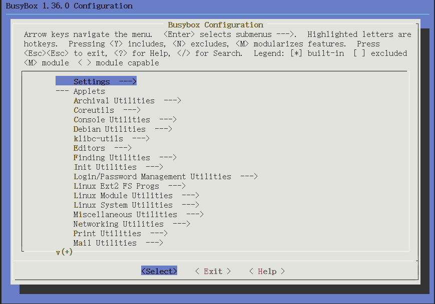

# 初始文件系统

你可能听说这样一句话，linux 一切皆文件，各种总线 设备 调试系统 等都通过文件系统来向用户空间提供接口，并负责管理访问权限。几乎所有的接口都被抽象为文件，debugfs tmpfs 等。

操作系统的功能是管理各种硬件资源，为各种应用程序服务，一个不运行程序的系统是没有意义的。这就是 rootfs 存在的意义，负责存初始化配置,用户程序，运行库等。 把最终控制权交给用用户应用程序。

## 文件系统

文件系统有通用的 FAT,FATFS windows 下的 NTFS linux EXT4 等，主要的作用就是规范文件的在存储设备上数据格式，负责文件的索引，加密，坏点管理等功能。不同的文件系统的存储格式不相同, 只能被特定的文件系统识别和处理。

Rootfs 也一样，它通过 `cpio` 程序制作的特定格式的数据，能被 linux 识别，并访问其中的文件。应为是第一个文件系统需要通过系统启动参数传递给内核。这跟启动应用程序通过命令行传递参数一样, 可以在启动时读取这些参数。启动时便会将它挂在在系统中。你可能了解 “树” 这种数据结构，文件的索引正式这种结构，与 window 不同的是， linux 只提供了一个根节点，你只能将分区挂载为目录，在 windows 提供了盘符概念，允许你将分区指定盘符。

### 分区

TODO: 待补充

## 制作 InitRamfs

你可能使用过 `tar` 这个程序，通常被用于打包压缩文件。[`cpio`](https://www.linuxjournal.com/article/1213) 根它很相似，主要的作用就是将文件打包并组织一块二进制数据。而这块数据是 linux 默认支持识别并解析的，你可把它当作一个文件系统。而其他三方文件系统需要定制内核以支持特定的文件系统。

内核加载 initramfs 的方式有多种两种：
- 直接编译到内核中，内核启动时会自动加载。但是每次修改 initramfs 都需要重新编译内核。
- 打包为 cpio 归档文件，通过 bootloader 传递给内核，这种方式跟 initrd 使用的方式一样内核会根据数据格式自动识别。

这里选用第二种方式。

initramfs 里需包含一个 init 程序，作于第一个用户进程，用与启动其他进程。

`/root/initramgfs/` 包含一个示例初始化程序和 busybox。在此目录下执行 `make init`, 会生成 包含 init 可执行程序的 initramfs.cpio.gz。`make initramfs` 构建 busybox 生成 initramfs.cpio.gz。 `make clean` 清理所有的生成的文件。

### 构建 busybox

[busybox](https://busybox.net/FAQ.html#getting_started) 被成为嵌入式的瑞士军刀，主要包含一个 初始化程序以及 shell 和 常用的命令行可执行程序。构建的方式同构建内核的方式一摸一样。
- 配置 busybox
在 `/root/initramgfs/busybox-1.36.0/` 目录下执行下面命令，已配置 menuconfig.
```bash
make make O=./out CROSS_COMPILE=arm-linux-gnueabihf- menuconfig
```


可以根据你的需求配置所需要的工具。默认情况下，busybox 是动态链接的，你需要将 动态库也一起打包到 busybox 中，交叉编译器的动态库放在 `/usr/arm-linux-gnueabihf/lib/` 目录下，下面命令便是将动态库拷贝到 out/lib 文件夹中，在打包时一起打包到 initramfs 中。
```bash
cp /usr/arm-linux-gnueabihf/lib/* -t /root/initramfs/out/lib/ 
```
如果你不想将编译器的动态库打包到跟文件中, 你可以将 busybox 配置为静态链接。
设置路径为 Settings -> Build static binary (no shared libs), 将其启用即可。

::: warning
当 busybox 配置为动态链接时，如过打包的路径中不包含动态库，busybox 将无法运行。通常返回错误码 -2。示例的 init 程序便为 静态链接运行时无需静态库。
:::
- 构建 busybox

执行下面命令构建 busybox。
```bash
make ARCH=arm O=./out CROSS_COMPILE=arm-linux-gnueabihf- busybox
```
- 安装到 out 目录
```bash
make ARCH=arm O=./out CROSS_COMPILE=arm-linux-gnueabihf- CONFIG_PREFIX=../../out install
```

### 生成 initramfs

以 `/root/initramgfs/out/` 为根目录，将里面的文件和目录打包生成 cpio 归档文件，为了减小空间还可以对归档文件进行压缩。在 out 目录下执行下面命令，生成压缩后的 initramfs.cpio.gz。

```bash
find . | cpio -o -H newc | gzip > ../initramfs.cpio.gz
```

## 内核启动流程

> Starting with kernel 2.5.x, the old “initial ramdisk” protocol is getting {replaced/complemented} with the new “initial ramfs” (initramfs) protocol. The initramfs contents is passed using the same memory buffer 
> protocol used by the initrd protocol, but the contents is different. The initramfs buffer contains an archive which is expanded into a ramfs filesystem; this document details the format of the initramfs buffer 
> format.
> 
> The initramfs buffer format is based around the “newc” or “crc” CPIO formats, and can be created with the cpio(1) utility. The cpio archive can be compressed using gzip(1). One valid version of an initramfs buffer  > is thus a single .cpio.gz file.
>
> ----- 引用自[initramfs buffer format](https://www.kernel.org/doc/html/v5.14/driver-api/early-userspace/buffer-format.html)