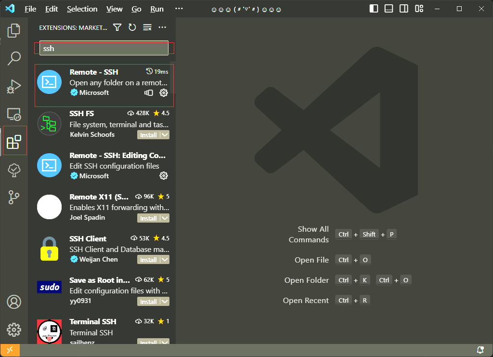
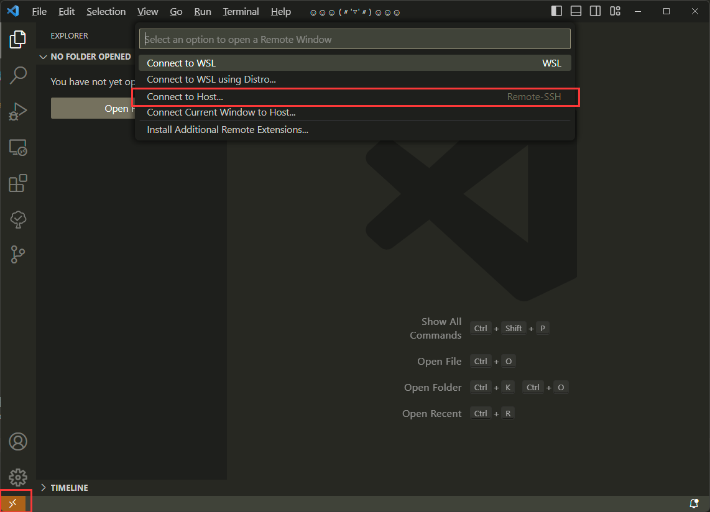
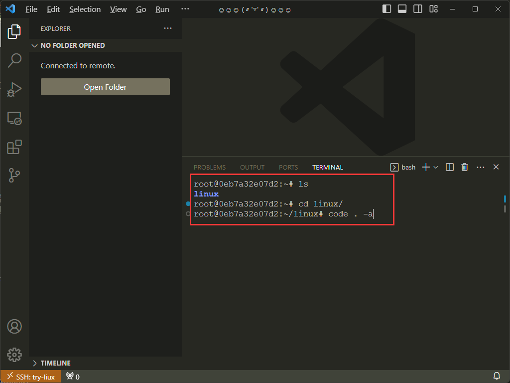

# 使用 Vscode 连接服务器

[vscode](https://code.visualstudio.com/) 是一个开源的文本编辑器, 默认支持 typescript，JavaScript 等语言的自动补全，高亮提示等。基于 node electron 开发，得益于脚本的语言方便扩展以及开源的特性，许多开发者贡献该项目，并却为其开发许多扩展，使其成为了可高度自定义，功能丰富的编辑器。

你可以访问[Vcode官方文档](https://code.visualstudio.com/docs)，了解其详细的功能。

## 安装 Vscode

 进入 **[Vscode 下载页](https://code.visualstudio.com/#alt-downloads)** 来获取最新的稳定版的 [vscode](https://code.visualstudio.com/)。

通常国内用户下载都比较慢，这是因为下载源是国外的。你可以将下载链接中的域名替换为 `vscode.cdn.azure.cn`, 如此一来你便可以通过国内的镜像源来下载。


在安装过程中建议勾选这几项，这将提高使用体验。

### 安装扩展

安装完成后，打开 vscode，默认是不支持远程开发功能的，需要安装 remote-ssh 来启用此功能。



- 1. 首先点击最左侧的扩展图标，打开扩展市场
- 2. 扩展搜索栏搜索 `ssh`
- 3. 点击安装 Remote-ssh 扩展即可
- 4. 根据提示是否需要重启即可

## 连接到服务器

准备工作已经结束了，可以正式的进行连接工作了。

通过[安装并启动章节](./README.md), 我们已经验证服务器可以成功连接，并且设置好密钥来实现免密连接了。
Remote-ssh 扩展正是 通过 ssh 连接到远程服务器来实现远程开发的，连接之后会 在服务器上安装 vscode-server 服务，来处理客户端的请求。



- 1. 点击最左下角的连接图标
- 2. 在弹出来的选项中选择 `Connect to Host...` ➡️ `Add New SSH Host` 
- 3. 最后输入 ssh 连接命令, 就像 [测试连接](./README.md#测试连接) 章节一样，如：`ssh root@localhost`

::: tip 提示
```bash
ssh root@`hostname`.local
```
不要在连接命令中输入像上面中的 `hostname` 那样的子命令，如过在本机你可以使用 `localhost` 代替, 就像下面这样。
```bash
ssh root@localhost.local
#或
ssh root@127.0.0.1
```
:::

### 跨设备连接

如果需要在局域网的另一台设备，连接你需要关闭防火墙或则设置策略来允许外部主机连接。随后你可以使用 主机 的IP地址来连接。
你也可以通过 MNDS 的域名来连接，以 `.local` 结尾的域名或通过 MDNS 去解析 IP 地址，MNDS 是在局域网内通过名字来解析 IP 地址的设备发现协议。
可以通过 `hostname` 命令获取到主机的名字，然后 加上 `.local` 的域名来连接。如：
```text:no-line-numbers {1,3}
PS C:\Users\11396> hostname
join
PS C:\Users\11396> ssh root@join.local -p 222
Welcome to Ubuntu 20.04.5 LTS (GNU/Linux 5.15.90.1-microsoft-standard-WSL2 x86_64)

 * Documentation:  https://help.ubuntu.com
 * Management:     https://landscape.canonical.com
 * Support:        https://ubuntu.com/advantage

This system has been minimized by removing packages and content that are
not required on a system that users do not log into.

To restore this content, you can run the 'unminimize' command.
Last login: Sun Mar 12
```

### 打开源码目录



当显示以上界面时便成功连接到容器中的服务器。其中的命令行界面便是连接到的服务器上的虚拟终端。你可以通过 `code` 命令来 `vscode` 交互。
在其中执行下列名命令，当前的 vscode 窗口便会重新加载，并打开 linux 源码目录。
```bash
root@0eb7a32e07d2:~# ls
linux
root@0eb7a32e07d2:~# cd linux/
root@0eb7a32e07d2:~/linux# code . -a
```
你可以通过 快捷键 <kbd>Ctrl</kbd>+<kbd>`</kbd>, 快速定位到终端。

你可以阅读 [Vscdoe TipS](https://code.visualstudio.com/docs/getstarted/tips-and-tricks), 了解更多特性。
